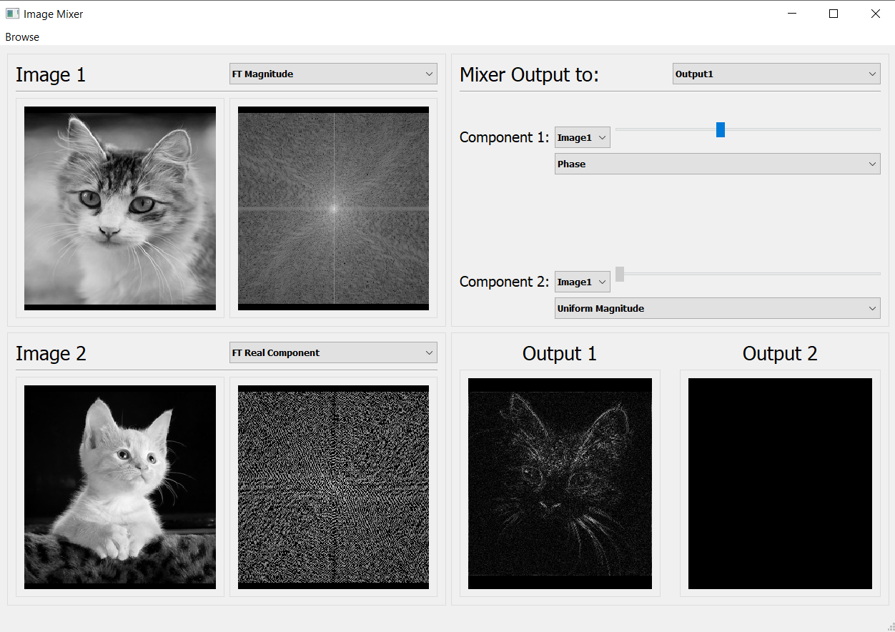

# Magnitude-phase-Mixer
The aim of this task is to design and implement a piece of software that explains the relative importance of the magnitude and phase components. We will do this task on a 2D signal.

When you run the app the main window will be like:

After then  you click on browse to choose your images you want to display

 The images should be of the same size otherwise it will give an error and requests to enter an image of the same size

After you add the images you shall do any of the following operations on each image such as getting it's magnitude, phase, real, and imaginary components

After we get the images components we shall mix them up together using the one component of the first image and the other component from the second image to get the output reslts like:

# DFT vs FFT
A piece of code is written to implement Fast Fourier Tranform and Normal Fourier Tranform in C++ and called in Python to compare the speed of excuation between the two Fourier methods.

